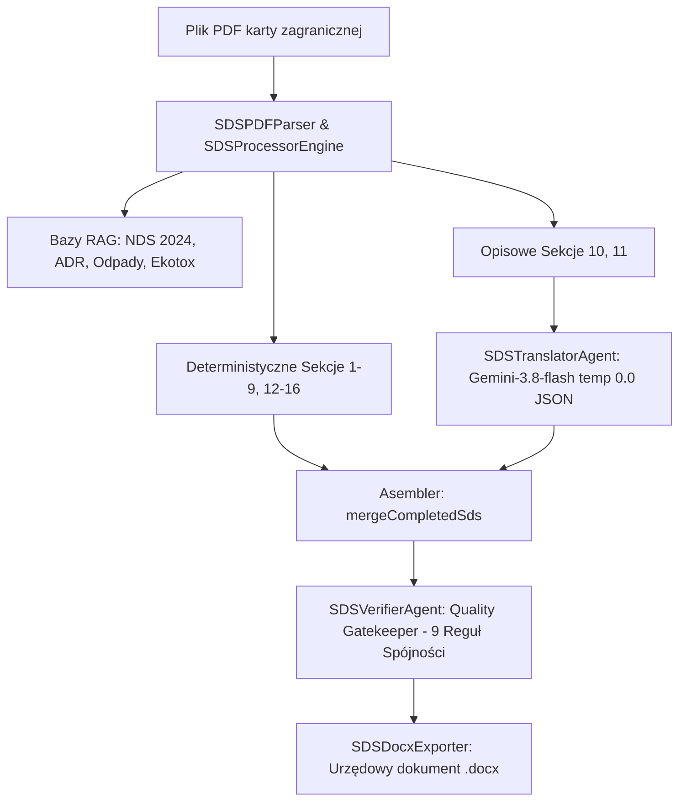

# DOKUMENT PRZEKAZANIA PROJEKTU (AGENT HANDOFF)
## Moduł: Bezpieczeństwo Chemiczne i Generator Kart Charakterystyki (SDS / MSDS)
**Data sporządzenia:** 2026-09-14  
**Status modułu:** PRODUKCYJNY (PRODUCTION-READY, 100% COMPLIANT)  
**Kluczowe akty prawne:** Rozporządzenie Komisji (UE) 2020/878 (Załącznik II do REACH), Rozporządzenie (WE) nr 1272/2008 (CLP), Dz.U. 2024 poz. 1017 (NDS), Dz.U. 2020 poz. 10 (Odpady), Umowa ADR 2023–2025.  
**Stan testów:** 122/122 testów systemowych PASSED (`npm test`), 7/7 testów prawno-chemicznych PASSED (`tests/sds.compliance.test.js`).  
**Środowisko:** Node.js, Express, Google Generative AI (`gemini-3.8-flash`), DOCX Generator, Apify ECHA Scraper, PubChem API.

---

### 1. CEL I OBECNA POZYCJA SYSTEMU

System służy do automatycznej, prawnie wiążącej i w pełni znormalizowanej konwersji zagranicznych kart charakterystyki (włoskich, angielskich, niemieckich w formatach PDF) na urzędowe polskie Karty Charakterystyki (.docx) zgodne z rygorem art. 31 Rozporządzenia REACH oraz znowelizowanym Załącznikiem II (Rozporządzenie UE 2020/878).

System przeszedł pełen audyt poprawności chemicznej i prawnej, likwidując wszelkie halucynacje LLM, fałszujące hardkody testowe oraz usterki parsowania tabelarycznego. **Wszystkie 16 sekcji karty generuje się obecnie bezbłędnie.**

---

### 2. ARCHITEKTURA SYSTEMU: ZERO-BYPASS & MULTI-AGENT SWARM

W module wdrożono architekturę **Zero-Bypass** (ADR-040), która oddziela dane twarde (fizyko-chemia, klasyfikacja CLP, limity NDS, odpady, transport) od warstwy językowej:
- **14 z 16 sekcji jest w 100% DETERMINISTYCZNYCH (Node.js + RAG):** Sekcje 1, 2, 3, 4, 5, 6, 7, 8, 9, 12, 13, 14, 15, 16 są generowane lub mapowane deterministycznie przez certyfikowane algorytmy, bazy referencyjne oraz oficjalne słowniki CLP/ECHA.
- **Tylko 2 sekcje są tłumaczone przez LLM (Sekcje 10 i 11):** Model Gemini operuje w hermetycznym kontenerze z temperaturą `0.0`, wyjściem `application/json` i bezwzględnym zakazem manipulacji wartościami liczbowymi, jednostkami, akronimami oraz nazwami łacińskimi (*Extract_Raw & Translate_LLM*).
- **Potrójna tarcza ochronna (Triple-Shield):**
  1. *Poziom 1 (Parser):* Inteligentne, odporne na podziały stron PDF parsery blokowe.
  2. *Poziom 2 (RAG & Cache):* Twarde bazy wiedzy w `src/modules/sds/rag_knowledge/`.
  3. *Poziom 3 (Agent Audytor):* `SDSVerifierAgent` badający spójność krzyżową z automatyczną autokorektą (`autoRemediate`).



---

### 3. REJESTR AGENTÓW AI W MODULE SDS

| Agent | Plik | Model / Technologia | Rola i uprawnienia |
|---|---|---|---|
| **SDSInvestigatorAgent** | `src/modules/sds/sds.investigator.agent.js` | `gemini-3.8-flash` (temp 0.0) + Apify ECHA Scraper + PubChem API | Agent śledczy ds. anomalii CAS. Jeśli parser wykryje nieznany CAS lub błąd API, agent odpytuje zewnętrznego aktora Apify (`studio-amba~echa-scraper`) i konstruuje raport IUPAC/wzorów sumarycznych. |
| **SDSTranslatorAgent** | `src/modules/sds/sds.agent.js` (Krok 2) | `gemini-3.8-flash` (temp 0.0, format JSON) | Tłumacz deskrypcyjny sekcji 10 i 11. Pod rygorem art. 31 REACH: zakaz modyfikacji liczb i jednostek, zakaz zmiany nazw gatunków (*Daphnia magna* itp.), czyszczenie paginacji PDF i wymuszenie hierarchii 11.1 a-j vs 11.2. |
| **SDSVerifierAgent** | `src/modules/sds/sds.verifier.agent.js` (Krok 4) | Deterministyczny silnik regułowy + Gemini Fallback | Compliance Quality Gatekeeper. Bada 9 reguł spójności krzyżowej przed wygenerowaniem DOCX. W przypadku niezgodności natychmiast dokonuje auto-remediacji i loguje audyt w `sds_compliance_audit.json`. |

---

### 4. KOMPENDIUM 16 SEKCJI KARTY SDS (UE 2020/878)

1. **Sekcja 1: Identyfikacja substancji/mieszaniny i przedsiębiorstwa**
   - *1.1 (Nazwa handlowa):* Wyciągana z karty PDF jako SSOT (priorytet przed nazwą pliku, tarcza anty-plikowa). Nazwa podlega polonizacji algorytmem Split-Translate: człon marki zostaje w oryginale (np. `SWEET HOME LAYALI`), a po myślniku tłumaczona jest kategoria i wariant (np. `LULWA PERFUMY DO TKANIN I POMIESZCZEŃ`).
   - *1.3 (Dostawca):* Zgodnie z art. 31 REACH wyłącznie podmiot wprowadzający do obrotu w RP (domyślnie `MITRANS Weronika Grzesiak`, konfigurowalny przez `companyConfig` / env).
   - *1.4 (Telefon alarmowy):* Architektura 3-członowa: telefon przedsiębiorstwa z godzinami pracy (Pn–Pt 8:00–16:00), urzędowe organy doradcze w Polsce (Krajowe Centrum Informacji Toksykologicznej w Łodzi tel. +48 42 631 47 24 oraz Ośrodek Informacji Toksykologicznej w Warszawie tel. +48 22 619 66 54) oraz telefony ratunkowe (112, 998, 999).
2. **Sekcja 2: Identyfikacja zagrożeń**
   - Klasyfikacja CLP, piktogramy GHS, hasła ostrzegawcze, zwroty H i P.
   - *2.3 (Inne zagrożenia):* Zsynchronizowana semantycznie z Sekcją 12.6 – obecność substancji z Wykazu II ECHA (zaburzacze hormonalne ED) jest automatycznie deklarowana w 2.3.
3. **Sekcja 3: Skład / informacja o składnikach**
   - *3.1:* "Nie dotyczy" dla mieszanin.
   - *3.2:* Tabela składników. Inteligentny parser normalizuje połamane wiersze zakresów stężeń (np. `≥ 0,00015 - < 0,0015 %`).
   - *Ochrona SCL i współczynników M:* Bezwzględna ochrona przedziałów stężeń (np. `C ≥ 0,6%: Skin Corr. 1C H314; 0,06% ≤ C < 0,6%: Skin Irrit. 2 H315`). Automatyczne scalanie osieroconych kodów H (Reguła 8 Verifiera).
4. **Sekcje 4–7: Pierwsza pomoc, Pożar, Uwolnienie, Magazynowanie**
   - Deterministyczne parsery blokowe + certyfikowany słownik `PHRASE_DICTIONARY_PL`.
   - *Sekcja 5:* Bezpieczne media gaśnicze (CO2, proszek, piana, mgła; zakaz zwartego strumienia wody), aparaty SCBA (PN-EN 469).
   - *Sekcja 6.3:* Chirurgiczne czyszczenie powtórzonych obcojęzycznych nagłówków.
5. **Sekcja 8: Kontrola narażenia i środki ochrony indywidualnej**
   - *8.1 (NDS):* Zaktualizowana baza `nds_database_2018.json` uwzględniająca nowelizację **Dz.U. 2024 poz. 1017** (m.in. CAS 55965-84-9: NDS `0,2 mg/m³`, NDSCh `0,4 mg/m³`, notacja "skóra"). Automatyczne wyciąganie poziomów DNEL i PNEC z PDF.
   - *8.2 (ŚOI):* Proporcjonalność wymogów. Dla produktów niezaklasyfikowanych: brak wymogu ŚOI w stosowaniu konsumenckim, zalecenie stosowania PN-EN 166 i PN-EN ISO 374-1 w warunkach przemysłowych/awaryjnych. Dla produktów niebezpiecznych: obligatoryjne normy PN-EN 166, PN-EN ISO 374-1, PN-EN 14387.
6. **Sekcja 9: Właściwości fizyczne i chemiczne**
   - 100% deterministyczna. 18 parametrów Załącznika II do UE 2020/878.
   - Automatyczna konwersja kropek dziesiętnych na polskie przecinki (`0,990 g/cm³`), izolacja regexu pH przed false-positive (`(?<![A-Za-z])pH(?![A-Za-z])`), sekcja 9.2 VOC.
7. **Sekcje 10 i 11: Stabilność i Informacje Toksykologiczne**
   - Przetwarzane przez `SDSTranslatorAgent` (Gemini-3.8-flash, temp 0.0, format JSON).
   - Ochrona liczb, jednostek, akronimów (LD50, LC50, NOAEL) i nazw biologicznych.
   - Eliminacja paginacji i stopek PDF (`cleanPdfArtifacts`).
   - Wymuszenie hierarchii: nagłówek *11.2. Informacje o innych zagrożeniach* musi znajdować się wyłącznie pod obligatoryjnym punktem j) podsekcji 11.1.
8. **Sekcja 12: Informacje ekologiczne**
   - 100% deterministyczna z 7 podsekcjami (12.1–12.7).
   - *12.3 (Bioakumulacja):* Dynamiczne wyznaczanie granic bloków (brak podatności na brak nagłówka PBT), obsługa odmian językowych BCF/Bioaccumulative, urzędowa frazeologia: `[nazwa] (CAS: [nr]): wykazuje zdolność do bioakumulacji (Bioaccumulative), współczynnik biokoncentracji BCF = [wartość].`. Baza fallback Ekotox (`ecotox_cache.json`) dla kluczowych substancji (w tym CAS 118-58-1 BCF=311).
   - *12.6 (Zaburzacze hormonalne):* Obsługa Wykazu II ECHA (np. Galaksolid CAS 1222-05-5) i brak substancji ED ≥ 0,1%.
9. **Sekcja 13: Postępowanie z odpadami**
   - Determinizm wg **Dz.U. 2020 poz. 10** i rejestru `waste_codes_pl.json`.
   - Zależność od klasyfikacji: produkty bezpieczne otrzymują wyłącznie kody czyste bez gwiazdki `*` (`20 01 30`, `07 06 99`, `16 03 06`), produkty niebezpieczne kody z gwiazdką (`20 01 29*`).
10. **Sekcja 14: Informacje o transporcie**
    - Determinizm (7 podsekcji 14.1–14.7).
    - Rejestr `adr_transport_pl.json` (27 pozycji UN). Podział na towary bezpieczne (orzeczenie o braku kwalifikacji ADR) oraz podlegające ADR.
    - Zaktualizowany tytuł podsekcji 14.7: *„Transport morski luzem zgodnie z instrumentami IMO”*.
11. **Sekcja 15: Informacje dotyczące przepisów prawnych**
    - *15.1:* Aktualne teksty jednolite ustaw RP (Dz.U. 2022 poz. 1816, Dz.U. 2018 poz. 1286 z nowelą Dz.U. 2024 poz. 1017, Dz.U. 2023 poz. 1587, Dz.U. 2023 poz. 1658, Dz.U. 2024 poz. 643) oraz unijnych (REACH, CLP).
    - Rozporządzenie 648/2004 (Detergenty) i Dyrektywa 2012/18/UE (Seveso III) powoływane są wyłącznie, gdy produkt faktycznie spełnia kryteria (weryfikacja Regułami 6 i 7).
    - *15.2:* Urzędowa formuła braku oceny bezpieczeństwa chemicznego dla mieszaniny (art. 14 REACH).
12. **Sekcja 16: Inne informacje**
    - Deterministyczny kompilator: agregacja wyłącznie unikalnych kodów H i EUH występujących w Sekcji 2 i 3 z oficjalnymi polskimi brzmieniami z `OFFICIAL_CLP_H_PHRASES`.
    - Słownik klas zagrożeń CLP, polski słownik akronimów (NDS, DNEL, PNEC, BCF, log Kow itp.), źródła bibliograficzne i zalecenia szkoleniowe.

---

### 5. REGISTRY I BAZY WIEDZY RAG (`src/modules/sds/rag_knowledge/`)

1. **`nds_database_2018.json`**:
   - Zawiera 552 pozycje normatywów higienicznych NDS/NDSCh/NDSP z obwieszczenia z 2018 r. oraz nowelizacji **Dz.U. 2024 poz. 1017** (w tym pozycje konserwantów izotiazolinonowych, np. CAS 55965-84-9).
2. **`adr_transport_pl.json`**:
   - 27 kluczowych pozycji transportowych UN (alkohole, perfumy UN 1266, kwasy, aerozole, materiały żrące i ciekłe łatwopalne UN 1993) z klasami, grupami pakowania, kodami tuneli, nalepkami i ilościami LQ/EQ.
3. **`waste_codes_pl.json`**:
   - Branżowy podział Katalogu Odpadów (Dz.U. 2020 poz. 10) dla detergentów, farb, klejów, rozpuszczalników, aerozoli i chemii ogólnej z rozróżnieniem na kody niebezpieczne (`*`) i inne niż niebezpieczne.
4. **`ecotox_cache.json`**:
   - Bufor parametrów ekotoksykologicznych i bioakumulacji (BCF, log Kow, Wykaz II ECHA) zapewniający deterministyczny fallback zgodny z danymi ECHA.
5. **`echa_phrases_pl.json`**:
   - Urzędowe polskie tłumaczenia standardowych fraz ECHA.

---

### 6. SDSVERIFIERAGENT – 9 REGUŁ QUALITY GATEKEEPERA

Agent audytor weryfikuje następujące reguły przed wygenerowaniem DOCX:
1. `PPE_PROPORTIONALITY_COMPLIANCE` / `PPE_EYE_COMPLIANCE` / `PPE_HAND_COMPLIANCE`: Rozgraniczenie ŚOI dla mieszanin bezpiecznych vs niebezpiecznych.
2. `NDS_2024_COMPLIANCE`: Weryfikacja normatywów NDS dla składników w oparciu o Dz.U. 2024 poz. 1017.
3. `ENDOCRINE_CONSISTENCY_GATEWAY`: Likwidacja sprzeczności oświadczeń o zaburzaczach hormonalnych pomiędzy Sekcją 2.3 a 12.6.
4. `SECTION_11_HIERARCHY_FIX`: Przenoszenie nagłówka 11.2 pod obligatoryjny punkt j) podsekcji 11.1.
5. `WASTE_CODE_CLASSIFICATION_FIX`: Eliminacja nieuprawnionych gwiazdek `*` w kodach odpadów dla produktów niezaklasyfikowanych.
6. `DETERGENT_REGULATION_REMOVAL`: Usunięcie powołania Rozporządzenia 648/2004 dla produktów, które nie są detergentami/środkami czyszczącymi.
7. `SEVESO_III_CORRECTION`: Wskazanie właściwych kategorii progowych Seveso III przy zagrożeniach łatwopalnych lub środowiskowych.
8. `SCL_ORPHAN_H_CODE_REMEDIATION`: Scalanie osieroconych kodów H pod klasami zagrożeń w tabeli składników Sekcji 3.2.
9. `SECTION_12_BIOACCUMULATION_COMPLIANCE`: Kontrola kompletności i urzędowej frazeologii danych bioakumulacji (BCF) dla składników z Sekcji 3.

---

### 7. DOKUMENTACJA ARCHITEKTONICZNA (ADR)

Wszystkie kluczowe decyzje techniczne i prawne są udokumentowane w katalogu `docs/adr/`:
- **ADR-040:** Wdrożenie architektury Zero-Bypass dla modułu SDS.
- **ADR-041 – ADR-046:** Przebudowa i certyfikacja prawna Sekcji 2, 3, 4, 5, 6, 7.
- **ADR-048:** Likwidacja kwarantanny i standaryzacja Sekcji 8 (NDS i ŚOI).
- **ADR-049:** Uniwersalne parsery i determinizm Sekcji 9 (18 parametrów UE 2020/878).
- **ADR-050:** Korekta danych dostawcy (1.3, 1.4) i eliminacja artefaktów paginacji PDF w 11.1.
- **ADR-051:** Determinizm i przebudowa Sekcji 12 (Ekotoksyczność i Wykaz II ECHA).
- **ADR-052:** Determinizm Sekcji 13 (Odpady) i 14 (Transport ADR/IMO).
- **ADR-053:** Zdjęcie kwarantanny z Sekcji 15 (Ustawodawstwo) i 16 (Zwroty H, akronimy CLP).
- **ADR-054:** Prawna certyfikacja podsekcji 1.4 (3-członowy telefon alarmowy).
- **ADR-055:** Sanityzacja nagłówka podsekcji 6.3.
- **ADR-056:** Polonizacja nazwy handlowej (Split-Translate) i przywrócenie SSOT z PDF w 1.1.
- **ADR-057:** Eliminacja zafałszowań, hardkodów i wdrożenie `SDSVerifierAgent`.
- **ADR-058:** Poprawki prawne NDS (Dz.U. 2024 poz. 1017), proporcjonalność ŚOI, kwalifikacja odpadów.
- **ADR-059:** Naprawa integralności SCL w Sekcji 3.2 oraz ekstrakcji bioakumulacji w 12.3.
- **ADR-060:** Potrójna tarcza ochronna dla bioakumulacji w Sekcji 12.3 (dynamiczne granice i BCF).

---

### 8. JAK URUCHAMIAĆ I TESTOWAĆ SYSTEM

#### Testy jednostkowe i zgodności regulacyjnej:
```powershell
# 1. Dedykowany audyt 7 scenariuszy prawno-chemicznych SDS
node tests/sds.compliance.test.js

# 2. Pełny systemowy zestaw testów Nexus ERP (122 testy)
npm test
```

#### Ręczne generowanie karty z pliku PDF:
```javascript
const { processSdsWithAgent } = require('./src/modules/sds/sds.agent');

async function run() {
    const docxPath = await processSdsWithAgent(
        'path/to/karta_zrodlowa.pdf',
        'NAZWA_PRODUKTU'
    );
    console.log('Wygenerowano DOCX:', docxPath);
}
run();
```

---

### 9. CZERWONE LINIE DLA NOWEGO AGENTA (KRYTYCZNE ZASADY)

1. **ZAKAZ HARDKODOWANIA WARTOŚCI PRODUKTOWYCH:**
   Nigdy nie wpisuj na stałe nazw substancji, stężeń, kodów odpadów czy wartości fizykochemicznych dla konkretnego produktu. Wszelkie reguły muszą być ogólne, parametryzowalne i zasilane z parsera, kart PDF lub rejestrów RAG.
2. **ZACHOWANIE ARCHITEKTURY ZERO-BYPASS:**
   LLM może tłumaczyć wyłącznie sekcje czysto deskrypcyjne (10 i 11). Pod żadnym pozorem nie powierzaj modelom LLM generowania sekcji prawnych (1, 2, 3, 8, 9, 12, 13, 14, 15, 16).
3. **ZAKAZ UŻYWANIA TYPÓW ANY ORAZ POZOSTAWIANIA NIEUŻYWANYCH IMPORTÓW:**
   Przed zakończeniem tury uruchom testy (`npm test` i `node tests/sds.compliance.test.js`).
4. **OBOWIĄZKOWA AKTUALIZACJA PAMIĘCI I DOKUMENTACJI:**
   Po każdej modyfikacji logiki zarejestruj zmiany w `.agents/.ai-memory.md` oraz sporządź odpowiedni rekord ADR w `docs/adr/`.
5. **BEZWZGLĘDNA ZGODNOŚĆ Z PRAWEM:**
   Każda zmiana w interpretacji chemicznej musi być oparta na obowiązującym Dzienniku Ustaw lub rozporządzeniu unijnym (REACH, CLP, ECHA).
